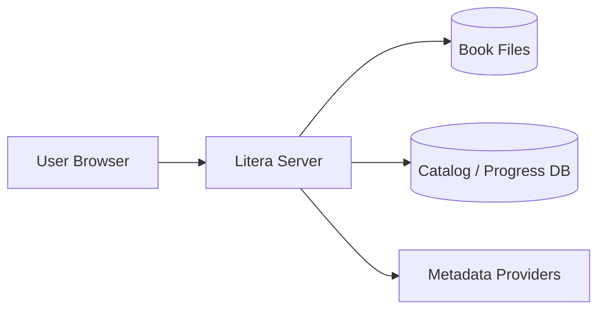

# Architecture Overview

## Context



## Logical containers

- **Web UI:** Vue/TypeScript application; responsive library and reader experience.
- **HTTP/API layer:** authentication, authorization, catalog, reader state, configuration.
- **Library scanner:** filesystem discovery, file identity, parsing/extraction, reconciliation.
- **Metadata engine:** matching and enrichment through provider adapters.
- **Reader subsystem:** format-specific adapters/rendering integration and normalized reader state.
- **Persistence:** catalog, users, metadata, reading progress, preferences.

## Dependency boundaries

- UI communicates with backend through a stable application contract; browser-local state is not the source of truth for progress.
- Scanner owns filesystem reconciliation; it must not let arbitrary web requests become filesystem paths.
- Metadata engine owns external provider calls and matching decisions.
- Reader owns format-specific locators but persists normalized progress through the backend.

## Reader architecture

```text
Reader Shell
  -> Format Adapter
     -> EPUB adapter / PDF adapter
  -> Reader State
     -> locator
     -> derived progress
     -> settings
  -> Progress Sync
     -> debounced persistence
```

A mature parser/rendering library may be used underneath an adapter. The Litera-owned contract remains responsible for UX, state, progress, and integration.

## Deployment

Initial target:

```text
Docker Compose
  ├── Litera application
  └── persistent database/storage
       ├── config
       ├── catalog
       └── mounted book libraries
```

The exact database engine and process split remain engineering decisions unless later requirements make them architectural constraints.
